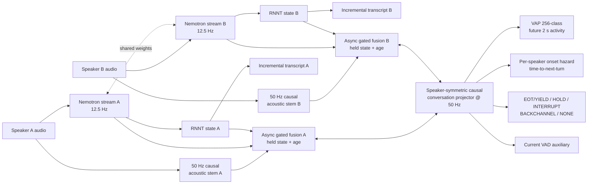

# Dual-rate Conversational Projection Transducer 구조 제안

## 질문

Streaming ASR과 미래 2초의 양 화자 대화 역학을 하나의 실시간 모델에서 예측하려면
어떤 구조가 현재 근거와 실험 결과에 가장 잘 맞는가.

## 결론

**50 Hz causal acoustic fast path와 12.5 Hz Nemotron semantic path를 비동기로 결합하는
dual-rate 구조**를 제안한다. ASR 경로만 80 ms 단위로 갱신하고, turn projector는
20 ms마다 최신 음향 상태와 마지막으로 도착한 ASR·RNNT 상태를 사용한다.

이 선택은 단순한 복잡도 추가가 아니다. [[task-stage1-encoder-probing]] 중간 결과에서
CPC 50 Hz가 Nemotron 12.5 Hz보다 EOT latency와 recall 모두 앞서며, frame rate 효과가
representation 차이만큼 크다는 신호가 나왔다. 반대로 HOLD와 EOT의 구분에는
[[acoustic-linguistic-fusion|RNNT predictor state]]가 필요하다. 두 요구를 한 속도로
강제하지 않고 역할별 시간축으로 유지하는 것이 핵심이다.

## 구조



### 1. Acoustic fast path

- 화자별 log-mel을 입력으로 받는 작은 causal Conv/TCN 또는 2층 causal Conformer.
- 50 Hz, `d=256`을 유지해 onset, overlap, pause와 같은 빠른 변화를 보존한다.
- 두 채널은 파라미터를 공유한다. 초기값은 CPC feature projection 또는 독립 log-mel
  stem을 비교하되, 최종 구조에는 무거운 두 번째 pretrained encoder를 넣지 않는다.

### 2. ASR semantic path

- v1 backbone은 [[decision-asr-backbone|Nemotron 3.5 ASR Streaming]] 80 ms chunk다.
- 화자 A/B를 batch 차원으로 묶어 같은 FastConformer를 통과시킨다. 파라미터는 한 벌이고
  streaming cache만 화자별로 유지한다.
- turn branch는 encoder state 외에 RNNT predictor hidden state, blank posterior,
  token emission 여부, 마지막 token 이후 경과 시간을 받는다.
- Qwen AuT는 causal fine-tune이 검증되기 전까지 v1에 넣지 않는다.

### 3. 비동기 gated fusion

ASR state를 50 Hz로 보간해 미래 정보가 있는 것처럼 만들지 않는다. 시각 `t`에 실제로
도착한 마지막 state만 hold하고, state age를 함께 준다.

```text
z_s(t) = LN(a_s(t)
          + g_enc(t)  W_enc h_enc_s(k(t))
          + g_ling(t) W_ling h_pred_s(k(t))
          + W_age age_s(t))
```

gate는 음향만으로 충분한 onset 구간에서는 닫히고, 문장 종결성이나 ASR confidence가
필요한 pause 구간에서 열릴 수 있다. acoustic residual이 항상 남기 때문에 느린 semantic
path가 빠른 경계 검출을 덮어쓰지 않는다.

### 4. Speaker-symmetric conversation projector

- 각 화자 stream에 같은 causal temporal block을 적용하고, 상대 화자의 과거 state에만
  cross-attention한다.
- A/B 채널 swap augmentation과 output permutation consistency loss를 사용한다.
- 이렇게 해야 데이터의 channel 0/1 관습을 화자 역할로 오학습하지 않는다.
- 권장 시작점은 `d=256`, 4 causal blocks, 4 heads다. Stage 1의 2층 probe보다 충분히
  크지만 638M ASR backbone에 비하면 작다.

### 5. 출력 head

1. **RNNT ASR:** 기존 transcription head를 보존한다.
2. **VAP:** 두 화자 × 4 horizon bit의 joint 256-class CE를 주 목표로 유지한다.
3. **Onset hazard:** 화자별 discrete-time hazard로 next onset과 censoring을 모델링한다.
4. **Event:** `EOT(YIELD)/HOLD/INTERRUPT/BACKCHANNEL/NONE`; 검증된 라벨만 학습한다.
5. **VAD:** 현재 발화 상태를 보조 학습해 acoustic timing을 안정화한다.

## 학습 절차

| 단계 | 학습 파라미터 | 목적 | 관문 |
|---|---|---|---|
| A | acoustic stem + projector + VAP/VAD head | 50 Hz timing 기준선 | CPC probe 이상 |
| B | fusion gate 추가, Nemotron/RNNT freeze | semantic state의 순수 기여 | 동일 FP에서 EOT latency 개선 |
| C | 상위 encoder 4층 또는 adapter만 unfreeze | task adaptation | WER/CER 회귀 허용치 이내 |
| D | hazard head | 더 이른 calibrated timing | p50 < 250 ms 목표 |
| E | event head | INT/backchannel 오류 감소 | 유도 라벨 검증 F1 통과 후 |

전체 손실은 다음으로 둔다.

```text
L = L_RNNT + lambda_vap L_VAP + lambda_h L_hazard
    + lambda_event L_event + lambda_vad L_VAD + lambda_swap L_swap
```

초기에는 turn loss가 ASR을 훼손하지 않도록 backbone을 freeze한다. joint 단계에서는
GradNorm 또는 uncertainty weighting을 쓰고, 모든 checkpoint를 WER/CER guardrail로
거른다. linguistic state는 gold token history만 쓰지 말고 streaming greedy hypothesis를
점진적으로 섞어 exposure bias를 측정한다.

## 필수 ablation

| 비교 | 답하는 질문 |
|---|---|
| 50 Hz acoustic only | 빠른 path만으로 어디까지 가능한가 |
| 12.5 Hz encoder only | ASR representation 자체의 효과는 무엇인가 |
| acoustic + encoder state | dual-rate가 frame-rate 손실을 회복하는가 |
| + RNNT predictor state | 언어 상태가 HOLD/EOT를 구분하는가 |
| + hazard | latency-recall 곡선을 실제로 당기는가 |
| + event | interruption/backchannel FP를 줄이는가 |
| gold state vs self hypothesis | ASR 오류가 fusion 이득을 얼마나 잠식하는가 |

평가는 [[turn-taking-evaluation-protocol]]을 그대로 사용한다. dev 기준 최소 목표는
`EOT recall >= 0.841 @ FPR <= 0.045`를 유지하면서 p50 latency를 463 ms에서
250 ms 미만으로 줄이는 것이다. 여기에 WER/CER, RTF, GPU memory, 실효 lookahead를
동시에 보고한다.

## 구현 우선순위와 중단 조건

1. Stage 1 전체 결과와 seed 반복을 먼저 끝낸다.
2. `acoustic only`와 `acoustic + encoder state` 두 조건으로 dual-rate의 필요성을 검증한다.
3. 이득이 있을 때만 RNNT predictor fusion을 추가한다.
4. event 라벨 검증 전에는 event head를 논문 핵심 결과에 사용하지 않는다.
5. semantic gate가 지속적으로 0에 수렴하거나 RNNT state가 자체 가설 조건에서 이득을
   잃으면 H2를 기각하고, 더 큰 통합 모델을 만들지 않는다.

## 불확실성과 위험

- Stage 1이 아직 끝나지 않아 ASR representation 우위는 확인되지 않았다.
- dual-channel Nemotron은 파라미터를 공유해도 계산량은 채널당 발생한다. 실제 RTF가
  허용되지 않으면 mixture 단일 ASR + speaker-conditioned acoustic readout을 후속으로 검토한다.
- 80 ms semantic state는 20 ms acoustic output보다 낡아 있다. 그래서 state age와 residual
  gate가 설계의 필수 요소다.
- [[source-turn-taking-related-work-2026|DualTurn]]의 generative pretraining을 이기지 못하면,
  같은 projector에 future latent prediction 보조 손실을 추가하는 Paper 2 방향을 검토한다.

## 근거

- [[streaming-conversational-projection-asr]] — 목표 모델과 H1/H2/H3
- [[acoustic-linguistic-fusion]] — cascade 없는 RNNT state 공유
- [[streaming-causality-and-latency-budget]] — 50 Hz 경로와 lookahead 회계 필요성
- [[turn-taking-objectives]] — VAP, hazard, event 다중 목표
- [[output-vap-turnbench-baseline-reproduction]] — 비교 기준선
- [[task-stage1-encoder-probing]] — 현재 representation 비교 결과
