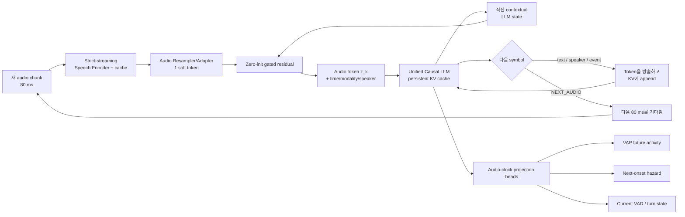

# Interleaved Streaming SLM 구조 계획과 비판적 평가

## 질문

독립 RNN-T transcriber 없이 streamable speech encoder와 causal LLM 하나가 실시간 전사,
endpointing, 화자·턴 이벤트, 미래 대화 역학을 함께 예측하려면 어떤 구조가 필요한가.

## 결론

권장 구조는 **Interleaved Streaming Speech Language Model(IS-SLM)** 이다. 80 ms마다
speech encoder가 만든 continuous soft token을 LLM의 KV sequence에 추가하고, LLM은 text/event
token을 0개 이상 방출한 뒤 `<NEXT_AUDIO>`로 제어권을 다음 audio chunk에 돌려준다.
미래 활동과 onset hazard처럼 매 audio 시점마다 필요한 출력은 autoregressive token으로 직렬화하지
않고, 같은 LLM audio-position hidden state 위의 작은 병렬 head로 계산한다.

사용자가 제안한 `다음 audio embedding + 직전 text embedding` 합은 **실험할 가치가 있는
ablation** 이지만 기본 구조로 고정하면 안 된다. causal self-attention의 KV cache가 이미 과거
text 전체를 다음 audio token에 조건화한다. 따라서 기본선은 명시적 합이 없는 interleaving이고,
추가 융합은 raw token embedding 대신 직전의 contextual LLM state를 쓰는 **zero-init gated
residual** 로 제한한다.

## 목표와 비협상 조건

1. 시각 `t`의 모든 출력은 `x_<=t`와 이미 방출한 token만 사용한다.
2. 80 ms chunk마다 encoder + audio-token LLM step이 deadline 안에 끝나야 한다. 평균이 아니라
   p99와 backlog를 측정한다.
3. 전사는 별도 RNN-T가 아니라 같은 LLM vocabulary에서 나온다.
4. sparse output(text, speaker, onset, endpoint, control)은 token으로, dense output(VAP, hazard)은
   audio-clock 병렬 head로 낸다.
5. 학습의 gold text history와 추론의 self-generated history 차이를 별도 실험으로 보고한다.

## 구조



### 1. Strict-streaming speech encoder

- 입력: 16 kHz, 80 ms chunk. 내부 frontend는 10/20 ms frame을 써도 되지만 외부 soft-token
  clock은 12.5 Hz로 고정한다.
- attention과 convolution 모두 명시적 좌측 cache만 사용한다. 허용 right-context가 있으면
  그 값을 출력 timestamp에 포함한다.
- encoder 출력 여러 frame은 causal resampler가 soft token 하나로 압축한다. 마지막 frame만
  쓰기보다 gated attention pooling을 쓰되 chunk 내부 미래를 보았다는 사실(최대 80 ms)은
  latency에 포함한다.
- dyadic stereo v1에서는 A/B 채널에 encoder weight를 공유하고 chunk당 speaker-tagged soft
  token 2개를 넣는다. single-mixture diarization은 그 다음 단계다.

### 2. Audio-text interleaving과 emission state machine

추론의 한 tick은 다음과 같다.

```text
audio 80 ms 수신
  -> speech encoder cache update
  -> audio soft token append
  -> LLM이 최대 M개의 text/event token 방출
  -> <NEXT_AUDIO>를 내면 즉시 yield
  -> stream 종료 시 <EMPTY_AUDIO>를 넣고 남은 text flush
```

Vocabulary에는 일반 text token 외에 `<NEXT_AUDIO>`, `<EMPTY_AUDIO>`, `<SPEECH_ONSET>`,
`<SPEECH_ENDPOINT>`, `<SPK_A>`, `<SPK_B>`를 둔다. 한 chunk에서 최대 `M`개만 생성하게 해
오디오 소비가 굶거나 decoder backlog가 무한히 쌓이지 않게 한다. v1 전사는 revision 없는
committed-prefix로 정의하고, partial revision protocol은 별도 버전에서 다룬다.

### 3. 제안한 summation fusion의 안전한 형태

```text
a_k = W_a Encoder(x_k, cache_E) + e_time(k) + e_modality + e_speaker
c_(k-1) = contextual hidden state after the previous emission cycle
g_k = sigmoid(W_g [a_k ; c_(k-1)] + b_g)
z_k = RMSNorm(a_k + alpha * g_k * W_c c_(k-1))
```

`alpha` 또는 `b_g`는 융합이 거의 0에서 시작하도록 초기화한다. raw text embedding 하나를
더하지 않는 이유는 (a) 마지막 subword가 과거 문맥 전체를 대표하지 않고, (b) modality 정보가
덧셈으로 섞이며, (c) 잘못 생성한 token이 다음 audio representation을 직접 오염시키기 때문이다.
비교해야 할 세 조건은 `interleaving only`, `raw sum`, `gated contextual residual`이다.

### 4. 하나의 SLM이지만 두 종류의 출력 clock

- **Autoregressive clock:** transcript, speaker tag, onset/endpoint, `<NEXT_AUDIO>`.
- **Audio clock:** 미래 2초 speaker activity, 상대 화자 next-onset hazard, 현재 VAD/turn state.

VAP 256-class를 매 80 ms마다 text token처럼 생성하면 serial decoding 비용과 vocabulary 경쟁이
생긴다. 병렬 head는 독립 모델이 아니라 같은 LLM hidden state를 읽는 task head이므로 통합
representation과 end-to-end 학습은 유지된다. → [[turn-taking-objectives]]

## 학습 계획

### U0 — streamability 증명

- 미래 audio를 바꿔도 과거 soft token이 변하지 않는 truncation/perturbation test를 먼저 통과한다.
- chunk 40/80/160 ms에서 lookahead, encoder ms/chunk, memory를 기록한다.
- [[source-qwen3-asr]] AuT를 초기값으로 쓴다면 현 구현의 비인과 경로를 그대로 사용하면 안 되고,
  causal mask fine-tuning이 선행되어야 한다.

### U1 — aligned interleaved ASR

- forced alignment의 token end time 이후에만 해당 text token을 target sequence에 배치한다.
- 여러 delay budget으로 `<NEXT_AUDIO>` 위치를 만들고, 동일 transcript에 대해 emission schedule을
  무작위화해 고정 지연 정책을 외우지 않게 한다.
- 초기에는 speech encoder·adapter와 소규모 LLM adapter를 학습한다. encoder 안정화를 위한
  auxiliary CTC는 학습 때만 허용하며 inference transcriber로 사용하지 않는다.

### U2 — self-conditioned streaming

- teacher forcing 100%에서 시작한 뒤 model-generated text history를 섞는다.
- gold history와 self history의 WER·delay 차이를 따로 보고, 잘못된 token을 주입하는 corruption
  훈련으로 오류 회복 능력을 만든다.
- 긴 sequence 학습은 20–60 s window부터 시작하고, 이전 text summary와 KV state를 carry한다.

### U3 — conversational multi-task

- audio-position hidden state에 VAP/hazard/VAD head를 붙인다.
- `<SPEECH_ONSET>`, `<SPEECH_ENDPOINT>`, speaker/event token을 함께 학습한다.
- 먼저 encoder/LLM을 freeze하고 head를 학습한 뒤, adapter와 상위 LLM layer를 점진적으로 연다.
- 손실 균형은 uncertainty weighting 또는 GradNorm을 쓰고 WER/CER 회귀를 guardrail로 둔다.
- **하이브리드 ablation**: 50 Hz causal 음향 사이드 브랜치(CPC)를 dense 헤드에만 공급하는 조건 vs 순수 12.5 Hz vs LLM 25 Hz — Stage 1 실측(50 Hz 우위) 대응. 이중 프레임율 모델(A)을 대조군으로 같은 TurnBench 규약에서 비교.

### U4 — adaptive emission

- supervised delay curriculum으로 안정화한 뒤에만 WER와 token emission delay를 함께 최적화하는
  minimum-risk 또는 RL 단계를 적용한다.
- [[source-muse-voice-transcribe]]와 같이 모델이 listen/write 결정을 학습하는 것이 목표지만,
  보상 최적화 전에 deterministic state machine과 alignment가 먼저 동작해야 한다.

### U5 — long-context와 배포

- 최근 30–60 s audio KV만 유지하고, 과거 audio는 recurrent summary로 압축하되 text/event KV는
  보존한다.
- chunk당 최대 생성 token, p99 처리시간, 최대 backlog를 hard limit으로 둔다.
- v1은 0.5–1.5B LLM로 검증하고, 모델 크기 확대는 real-time budget을 통과한 뒤에만 한다.

## 까다로운 평가

| 위험 | 왜 치명적인가 | 필요한 검증 / 중단 조건 |
|---|---|---|
| **명시적 sum이 중복** | KV attention이 이미 과거 text를 제공한다. 잘못된 text를 audio에 재주입할 수 있다 | interleaving-only보다 유의한 이득이 없으면 fusion 제거 |
| **emission alignment** | text를 너무 일찍 내면 hallucination, 늦게 내면 offline ASR과 다를 바 없다 | token별 evidence time 위반률 0, WER-delay Pareto 보고 |
| **teacher-forcing exposure bias** | 학습 때 gold token, 추론 때 오류 token이 다음 audio step을 오염시킨다 | gold/self gap을 보고하고 상대 WER 열화가 크면 강한 fusion 중단 |
| **decoder backlog** | 한 chunk의 text 생성이 80 ms를 넘으면 audio가 계속 밀린다 | p99 tick time <80 ms, 지속 backlog <1 chunk. 실패하면 early-exit wait policy/모델 축소 |
| **LLM hallucination** | 언어 prior가 불완전한 음향 증거를 덮어쓸 수 있다 | noise·동음이의·고유명사에서 deletion/substitution 외 hallucination rate 측정 |
| **미래 정보 누출** | streaming 성능 전체가 무효가 된다 | 모든 layer truncation audit, latency에 lookahead 포함 |
| **긴 audio KV** | 1시간이면 12.5 Hz에서 45k audio token, stereo는 90k다 | KV memory와 1시간 RTF 측정; local audio memory가 없으면 장문 목표 철회 |
| **dense task의 직렬화** | turn output까지 token으로 내면 text emission과 계산·vocabulary를 경쟁한다 | parallel head가 tokenized head보다 정확도/RTF 우세하면 병렬 head 채택 |
| **두 화자 순서 편향** | A→B token 순서가 가짜 선후관계를 만든다 | A/B 순서 교대, channel-swap consistency; 불변성 실패 시 joint chunk token 사용 |
| **multi-task 간섭** | turn loss가 transcription을 훼손하거나 LM이 turn head를 무시할 수 있다 | turn head 추가 후 WER/CER 회귀와 gradient conflict 측정 |
| **revision 의미 불명확** | partial transcript를 고치면 downstream agent state가 불안정하다 | v1 committed-prefix 고정; revision을 쓰면 명시적 revoke protocol 필요 |

## 핵심 ablation

1. streaming RNN-T baseline 대 IS-SLM.
2. interleaving only 대 raw sum 대 gated contextual residual.
3. fixed wait 대 learned `<NEXT_AUDIO>` 대 delay-optimized policy.
4. gold text history 대 self-generated history.
5. ASR only 대 ASR+endpoint 대 ASR+future projection.
6. 40/80/160 ms chunk의 WER·delay·turn latency·RTF.
7. text/event token만 대 audio-clock projection head 병행.

## 성공 기준

- **Streaming:** p99 chunk 처리시간이 chunk duration보다 짧고 장시간 입력에서 backlog가 누적되지 않는다.
- **ASR:** 동일 공개 streaming RNN-T 대비 WER/CER 열화가 허용 범위 안이며 TTFT와 time-to-final이
  경쟁 가능하다.
- **Turn:** [[turn-taking-evaluation-protocol]]의 동일 FPR에서 VAP recall을 유지하면서 p50 latency를
  낮춘다.
- **통합의 가치:** encoder-only turn head보다 self-generated LLM state를 더한 조건이 실제로 이득이어야
  한다. 이득이 없으면 “통합 SLM”은 계산만 늘린 것이다.
- **fusion의 가치:** interleaving-only보다 gated fusion이 이기지 못하면 summation 아이디어를 제거한다.

## 최종 판단

구조는 연구할 가치가 충분하다. 특히 Muse의 listen/write autoregressive loop를 endpointing에서
future conversational projection으로 확장하는 방향은 프로젝트 목표와 직접 맞는다. 그러나
핵심 기여를 **embedding summation** 으로 잡으면 약하고 실패 가능성이 높다. 더 강한 연구 질문은
“하나의 self-conditioned streaming SLM state가 별도 transcriber 없이 transcription과 미래 대화
역학의 WER-delay-turn Pareto를 동시에 개선할 수 있는가”이다.

## 불확실성

- Muse의 공개 설명은 80 ms soft token과 listen/write 정책을 밝히지만 weights와 세부 학습 구현은
  공개하지 않으므로 정확한 재현은 불가능하다.
- Qwen AuT는 현재 감사 결과 그대로는 strict streaming encoder가 아니다.
- self-conditioned fusion이 실질적 이득을 주는지는 아직 근거가 없고 반드시 ablation으로 판정해야 한다.

## 근거

- [[source-muse-voice-transcribe]] — 80 ms soft token, `<NEXT_AUDIO>`, adaptive delay, 통합 endpointing.
- [[source-qwen3-asr]] — audio/text interleaving 초기값 후보와 causality 제약.
- [[streaming-causality-and-latency-budget]] — 미래 누출, latency 회계, stereo 계산 비용.
- [[turn-taking-objectives]] — future activity/hazard/event 다중 목표와 손실 균형.
- [[turn-taking-evaluation-protocol]] — WER/CER, TTFT, revision, turn latency, RTF 평가축.
- [Moshi](https://arxiv.org/abs/2410.00037) (확인 2026-09-04) — streaming speech-text LM과 time-aligned text의 선행 사례.
- [Streaming Speech-to-Text Translation with a SpeechLLM](https://arxiv.org/abs/2605.14766) (확인 2026-09-04) — learned wait token과 early-exit wait policy의 선행 사례.

---

## 검토와 통합 (2026-09-04, 볼트 에이전트) — [[output-unified-slm-architecture-plan]] 과의 대조

### 동의하는 것 (보고서가 더 낫다)

1. **합산 융합은 기본선이 될 수 없다.** causal self-attention + KV 가 이미 과거 텍스트 전체를 다음 audio 토큰에 조건화한다. 직전 subword
   하나의 임베딩을 더하는 것은 정보량이 적고, 오인식 토큰을 audio 표현에 직접 주입한다. 보고서의 **zero-init gated contextual residual**
   이 그 아이디어의 올바른 형태이며, `interleaving only / raw sum / gated residual` 3조건 ablation 으로 격하하는 것이 맞다.
   → [[output-unified-slm-architecture-plan]] 의 v0 는 이 ablation 의 한 팔로 재정의한다.
2. **가변 방출 + `<NEXT_AUDIO>` 가 토큰율 상한을 푼다.** v0 의 최대 위험이던 "1 프레임 = 1 토큰"(한국어 BPE 폭주) 이 구조적으로 해소된다.
   chunk 당 M 개 상한과 p99·backlog 제약으로 실시간성을 지킨다는 규정도 타당하다.
3. sparse 는 토큰, dense(VAP/hazard) 는 audio-clock 병렬 헤드 — v0 와 동일한 결론. 정렬 기반 `<NEXT_AUDIO>` 배치 + 지연 무작위화,
   gold/self history 격차 보고, 학습 전용 auxiliary CTC 도 모두 타당하다.

### 보고서에 빠진 것 (이 볼트의 실측이 요구하는 수정)

| 쟁점 | 근거 | 수정 |
|---|---|---|
| **12.5 Hz audio clock 위의 turn 헤드** | [[task-stage1-encoder-probing]] 중간: CPC 50 Hz > CPC 12.5 Hz ≈ Nemotron 12.5 Hz, INT latency 1.3 s. 보고서는 프레임율 위험을 다루지 않는다 | **하이브리드**: 50 Hz causal 음향 사이드 브랜치(CPC, 5 M)가 dense 헤드에만 공급되고 LLM 은 12.5 Hz 를 유지. 순수 12.5 Hz 는 ablation (보고서 6번 ablation 의 40 ms chunk 조건과 연결) |
| **겹침 발화의 텍스트 직렬화** | 두 화자를 `<SPK_A>/<SPK_B>` 태그로 한 autoregressive 스트림에 넣으면 겹침 구간에서 단어 순서 규약이 필요하고 순서 편향이 텍스트에도 생긴다. 보고서는 audio 토큰 순서 편향만 다룬다 | 규약을 명시(예: chunk 내 종료 시각 순, 동시면 A 우선 + swap augmentation) 하거나, **화자별 텍스트 헤드 2개**(v0 안) 를 대안 ablation 으로 |
| **tick 당 LLM 스텝 수 = 2 + M** | chunk 당 audio 토큰 2개(A/B) + 텍스트 ≤ M → 80 ms 에 최대 (2+M) forward. 0.6B 는 A100 에서 가능하나 1.5B·소형 GPU 에서 p99 위반 가능. v0 는 1 forward/chunk | v1 은 보고서가 fallback 으로 둔 **joint chunk token**(A·B concat → 1 토큰) 을 기본으로 두고 2-토큰을 변형으로 — 시퀀스·KV 절반, 순서 편향 소멸 |
| **초기화 경로** | 보고서는 AuT 를 초기값 후보로만 언급 | 최종 backbone은 Nemotron `[56,0]`(실측 causal) + new adapter + **Qwen3-ASR thinker**이며 Paper 2에서도 유지한다. AuT causal 적응·encoder 교체는 주 경로에서 제거 — [[decision-asr-backbone]] |
| **평가 기준선** | "동일 공개 streaming RNN-T" 는 Nemotron 이며, 관문 수치가 없다 | U1 관문: WER/CER 상대 열화 ≤ 10 % ([[decision-target-architecture]]) |

### 통합 결론

**IS-SLM 을 기본 구조로 채택**한다 (사용자 판단과 일치). 단 (1) 50 Hz 사이드 브랜치 하이브리드(U3 ablation), (2) joint chunk token 기본, (3) 겹침 텍스트 규약,
(4) U1 WER 관문을 더한다. v0 의 합산 융합은 gated residual ablation 으로 남긴다.

**단계 표기 통일**: 이 보고서의 U0–U5 가 USLM 트랙의 정본 번호다. 토큰율·정렬 측정([[task-uslm-feasibility-u0]])은 U0 에, 하이브리드는 U3 에 속한다.
