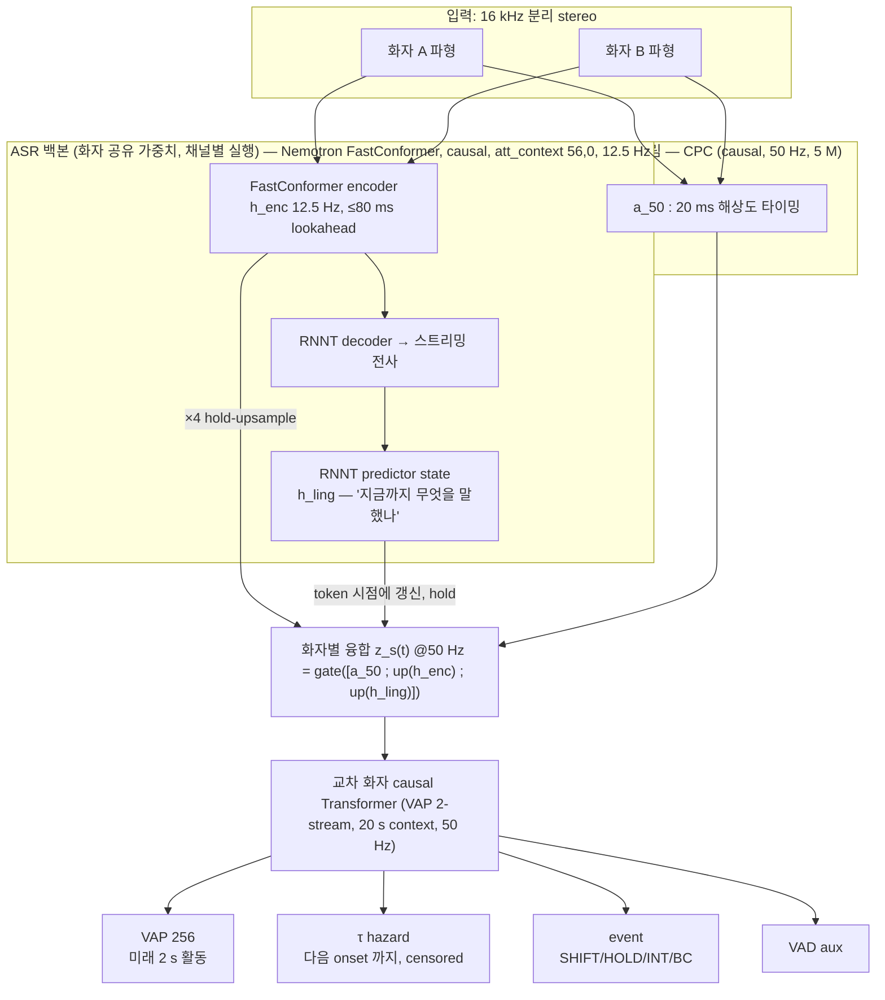

# 모델 구조 제안 (v1, 2026-09-04) — **SUPERSEDED**

> 2026-09-04 사용자 결정으로 **기각**. 주력은 [[output-interleaved-streaming-slm-architecture]] (IS-SLM). 이 문서의 실측 근거(이중 프레임율 필요성)는
> IS-SLM 의 U3 하이브리드 ablation 으로 이어진다. → [[decision-target-architecture]]

[[streaming-conversational-projection-asr]] 의 목표 — 하나의 streaming 표현에서 **transcription 과 미래 2 s 대화 역학을 동시에** —
를 지금까지의 실측 위에서 구체화한 안이다. 초안([[source-chatgpt-research-plan]])과의 차이는 **이중 프레임율** 과 **linguistic state 의 출처** 다.

## 한눈에



```text
                          16 kHz stereo (A, B)
                     ┌───────────┴────────────┐
      화자별 ×2      │                        │
 ┌───────────────────┴──────┐   ┌─────────────┴───────────────┐
 │ 빠른 음향 스트림 (50 Hz)  │   │ ASR 백본 (12.5 Hz, causal)   │
 │ CPC, 5 M, lookahead 0    │   │ FastConformer [56,0] ≤80 ms  │
 │ → a_50(t)  "언제"        │   │ h_enc(t)     "무슨 소리"     │
 └──────────────┬───────────┘   │ RNNT → 전사 (스트리밍)       │
                │               │ predictor state h_ling(t)     │
                │               │              "무슨 말을 했나" │
                │               └──────┬───────────────┬───────┘
                │        ×4 hold-upsample│        token 시점 hold
                └────────────┬──────────┴───────────────┘
                 z_s(t) = gate( [ a_50 ; up(h_enc) ; up(h_ling) ] )   @50 Hz, 화자별
                             │
            교차 화자 causal Transformer (2-stream, 20 s context, 50 Hz)
                             │
        ┌────────────┬───────┴────────┬──────────────┐
      VAP 256      τ hazard        event head       VAD
     (2 s 미래)  (onset 까지 시간)  SHIFT/HOLD/INT/BC  (aux)
```

## 왜 이 구조인가 — 실측과 연결

| 설계 결정 | 근거 |
|---|---|
| **이중 프레임율** (50 Hz 음향 + 12.5 Hz ASR) | Stage 1 중간: CPC 50 Hz > CPC 12.5 Hz ≈ Nemotron 12.5 Hz. **프레임율 효과가 인코더 효과보다 컸다.** 12.5 Hz 만으로는 INT latency 1.3 s. 타이밍은 빠른 스트림이, 의미는 ASR 스트림이 맡는다 ([[task-stage1-encoder-probing]]) |
| 빠른 스트림 = **CPC** | frozen 비교에서 최강이고 5 M 로 싸며 lookahead 0 ([[output-encoder-causality-audit]]). 새로 설계할 이유가 없다 |
| ASR 백본 = **Nemotron FastConformer [56,0]** | causal 실측 ≤80 ms, ko-KR ready, 좌측 4.5 s context, RNNT predictor state 가 명시적 ([[decision-asr-backbone]]). Qwen AuT 는 causal fine-tune 뒤 Paper 2 에서 교체 후보 |
| linguistic state = **RNNT predictor hidden** | 텍스트를 다른 모델에 다시 넣는 cascade 금지 ([[acoustic-linguistic-fusion]]). predictor 는 "지금까지 낸 토큰" 의 요약이라 정확히 필요한 것. token 시점에만 갱신 → 프레임에 hold |
| 화자 **공유 가중치, 채널별 실행** | 분리 stereo 가 실측으로 확인됨(누설 −64 dB). RTF 0.005 라 2회 실행 비용은 실시간의 1 % ([[output-feature-cache-and-compute-budget]]) |
| 교차 화자 **causal** Transformer | probe 와 동일 구조 — 헤드가 lookahead 를 더하지 않아 latency 회계가 `20 ms/2 + 80 ms + compute` 로 닫힌다 |
| 헤드 4개 | [[turn-taking-objectives]]: VAP 256 이 주, τ hazard(censoring) 가 "언제", event 가 해석·평가용, VAD 는 안정화 |

## 학습 단계 (모델 구조와 1:1)

```text
S1  frozen probing (진행 중)           — 어떤 스트림이 무엇을 담는가        → 이 문서의 이중 프레임율 근거
S2  융합 헤드 학습                     — CPC·FastConformer freeze, z_s + 교차 Transformer + 4 헤드 학습
    ablation: a_50 만 / h_enc 만 / a_50+h_enc / +h_ling                → H2 (semantic 이득), 한국어에서 더 큰가
S3  백본 상위 4–8 층 unfreeze          — L = λ_ASR·RNNT + VAP + τ + event + VAD, uncertainty weighting
    가드레일: WER/CER 회귀 ≤ 5 % 상대                                 ([[task-stage2-multitask-vap-with-wer-guardrail]])
S4  (Paper 2) 통합 토큰 스트림          — Qwen causal-adapted AuT + LLM state 가 h_ling, 디코더가 text/WAIT/EOT/HOLD/BC/INT 토큰을 한 스트림으로
```

## 추론 시 latency 회계 (TurnBench 규약: lookahead 를 시각에 접어 넣음)

| 경로 | 알고리즘 지연 |
|---|---:|
| CPC 50 Hz | 20 ms/2 = 10 ms |
| FastConformer [56,0] | 80 ms chunk + ≤80 ms 경계 = ≤160 ms 최악, 평균 ~120 ms |
| 융합·Transformer·헤드 | 0 (causal) |
| **합계** | **≤160 ms + compute** — 사람 −151 ms 에 닿기 위한 예산 안 |

빠른 스트림은 80 ms 의 ASR 지연을 기다리지 않는다: 융합 시 `up(h_enc)` 은 **가장 최근에 도착한 chunk** 를 hold 하므로 a_50 은 즉시 반영된다.
즉 "빠른 반응은 음향, 느린 의미 보정은 ASR" 로 역할이 갈린다 — INT latency 문제의 구조적 해법.

## 열린 질문 / 위험

1. **h_ling 의 시간 정렬**: RNNT 는 토큰을 실제 발화보다 늦게(수백 ms) 낸다. h_ling 이 turn 예측에 "너무 늦게" 도착하면 이득이 사라질 수 있다. → S2 ablation 에서 gold-aligned 텍스트 임베딩(상한)과 비교.
2. **50 Hz 로 up-sample 한 12.5 Hz 표현의 계단 효과**: hold 대신 learned interpolation 이 나은지 — 작은 ablation.
3. **CPC 를 계속 freeze 할 것인가**: S3 에서 함께 미세조정하면 ASR 과 무관한 음향 신호(호흡, 억양 하강)를 더 잡을 수 있다. 단 fbank floor 와의 차이(EOT 0.80 vs 0.88)가 "사전학습" 덕인지 "50 Hz" 덕인지는 S1 fbank 결과가 답한다.
4. **Qwen 교체 조건**: [[task-qwen-aut-causal-adaptation]] 에서 causal fine-tune 후 WER 회복 + lookahead ≤80 ms 가 확인되면 S4 백본. 그 전까지는 Nemotron.
5. **한국어**: 초안의 가설(어미 단서가 늦게 오므로 h_ling 이득이 더 크다)은 S2 의 KO/EN 분리 ablation 으로 검증 — [[korean-turn-taking-cues]].

## 초안 대비 바뀐 점

- 초안: "shared streaming ASR encoder → 하나의 representation → 두 헤드". **본 제안: 두 프레임율의 두 스트림을 융합.** 근거는 Stage 1 실측.
- 초안: linguistic state = "RNNT predictor 또는 Qwen decoder". **본 제안: Paper 1 은 predictor 로 고정**, Qwen 은 causal 적응 뒤.
- 초안에 없던 것: **latency 회계 표**, hold-upsample 정합, 학습 단계와 구조의 1:1 대응.
