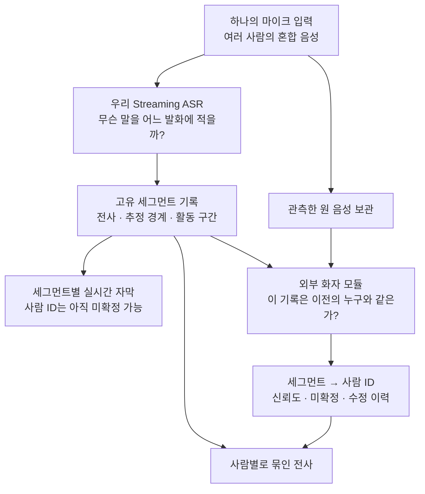
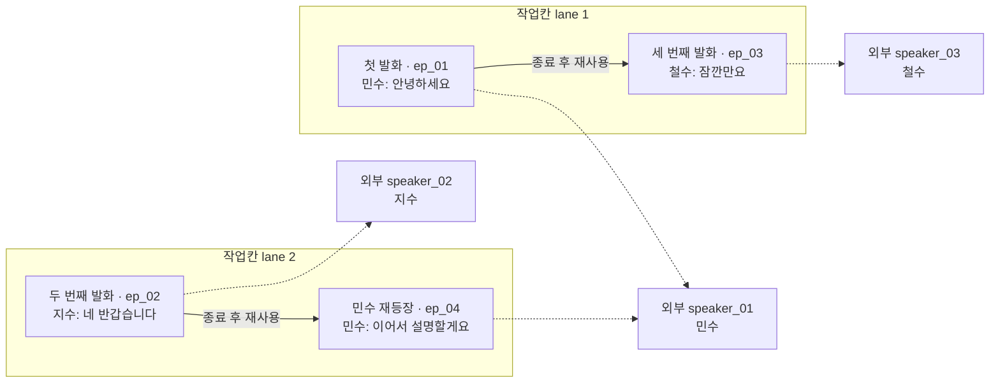
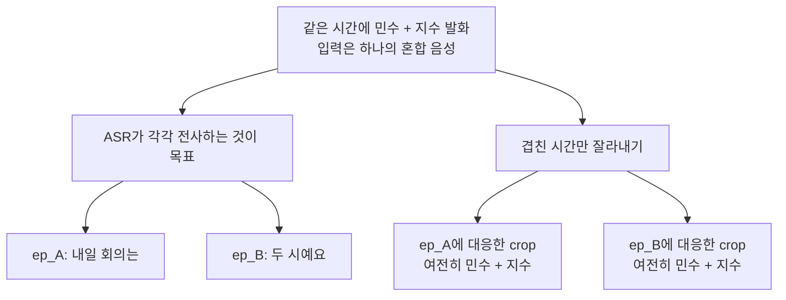
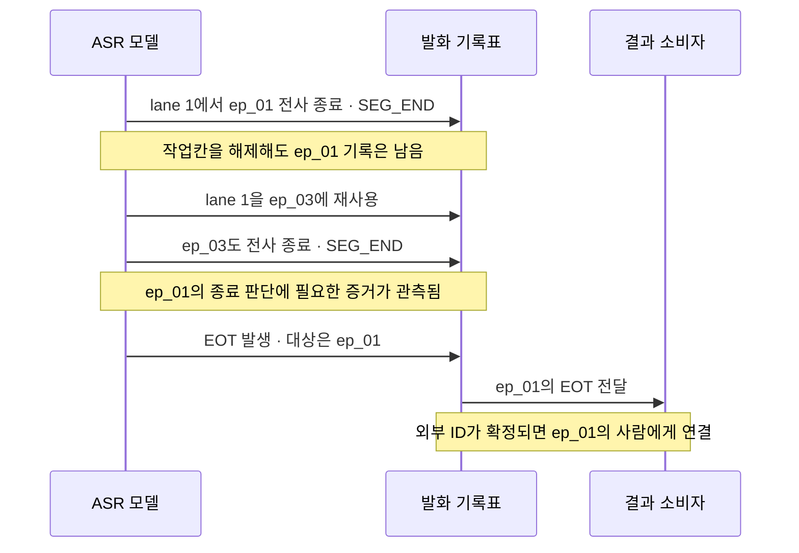

# 그림으로 보는 Phase 2: 전사는 모델이, 사람 연결은 외부에서

## 한 줄 요약

**ASR는 겹치는 말도 각각의 발화 기록으로 만들고, 외부 화자 모듈은 그 기록들을 같은 사람끼리 연결한다.** ASR가 회의 전체의 사람 명단을 관리하도록 학습하는 것은 우선 보류한다.

이 문서는 [[output-phase2-external-speaker-mapping-plan]]의 쉬운 해설이다. 아래 인물·문장·사건은 모두 **설명용 가상 예시**이며, 실제 추론 성공 사례가 아니다. 정본·토큰 registry·학습 코드는 변경하지 않았다. 그림의 경계·화자 구분·EOT는 앞으로 학습하고 검증할 기능이다.

## 그림 1. 전체 구조 — 두 가지 질문을 나눠 맡긴다

**ASR가 맡는 문제는 전사와 발화 구분이고, 외부 모듈의 문제는 사람 재식별이다.** 외부 모듈의 사람 ID가 늦게 나와도 전사 자체를 기다리게 할 필요는 없다. 처음에는 “발화 17”로 보여주고, 나중에 “화자 2의 발화 17”로 연결할 수 있다.

여기서 외부란 ASR 신경망 밖이라는 뜻이지 외부 유료 서비스라는 뜻은 아니다. 미등록 회의 참가자들을 묶으려면 외부 모듈에도 신규 화자·동일인 매칭·미확정 처리가 필요하다. 사람 ID는 익명의 `speaker_01`이어도 충분하며, 실제 이름을 알아내는 것은 별도 기능이다.

### 세 가지 이름만 구별하면 된다

| 이름 | 쉬운 비유 | 바뀌거나 재사용되는가? |
|---|---|---|
| lane | 지금 전사를 적는 **작업칸** | 발화 처리가 끝나면 다른 사람이 사용 가능 |
| segment / episode ID | 발화마다 붙이는 **기록 번호** | 재사용하지 않음. 이 문서에서 두 용어는 같은 처리 단위를 뜻함 |
| speaker ID | 외부 모듈이 붙이는 **사람 번호** | 서로 다른 기록을 같은 사람으로 연결. 판단은 수정 가능 |

작업칸이 같다고 같은 사람이 아니고, 기록 번호가 다르다고 다른 사람도 아니다. [[output-phase2-external-speaker-mapping-plan]] §2–3.

## 그림 2. 세 번째 사람이 첫 번째 작업칸을 써도 된다

실선은 작업칸의 재사용 순서이고, 점선은 외부 모듈이 판단한 사람 연결이다. 그림의 인물 이름은 독자를 위한 정답 설명이며 모델 입력이 아니다.

ASR는 민수가 돌아왔을 때 **처음의 lane 1로 되돌려야 할 의무가 없다.** ep_04의 내용을 다른 발화와 섞지 않고 기록하면 된다. 외부 모듈이 ep_01과 ep_04를 같은 사람으로 연결한다.

반대로 민수가 아직 말하고 있는 ep_01 안에 철수의 말을 이어 적으면 안 된다. 겹쳐 말하면 다른 작업칸을 열어야 한다. 즉, **장기 사람 기억은 빼지만 현재 진행 중인 발화의 일관성은 유지한다.** 짧은 무음 뒤에 사람이 바뀌는 경우도 시간 간격만 보고 같은 기록으로 병합하지 않는다.

### 무음·단일 발화·겹침에서 모델은 무엇을 내는가?

한 개의 decoder가 80ms 오디오 블록마다 필요한 출력들을 순서대로 낸다. 작업칸마다 별도 LLM을 실행한다는 뜻은 아니다. 아래는 사람용 축약 표기로, 실제 token ID나 정확한 정렬 시각을 지정한 학습 데이터는 아니다.

| 상황 | 출력의 의미 | 주의할 점 |
|---|---|---|
| 무음, 남은 전사·이벤트도 없음 | `NEXT_AUDIO` | 사람이나 EOT를 새로 만들지 않음 |
| 한 사람의 새 발화 | `LANE_1 → ONSET → 텍스트 → NEXT_AUDIO` | 새 기록 번호는 파서가 발급 |
| 그 사람이 계속 말함 | `LANE_1 → 추가 텍스트 → NEXT_AUDIO` | 같은 기록에 누적 |
| 다른 사람이 끼어듦 | `LANE_1 → 텍스트 / LANE_2 → ONSET → 텍스트 → NEXT_AUDIO` | 한 블록 안에서도 두 기록을 구분 |
| 전사 처리 종료 | `LANE_1 → SEG_END → NEXT_AUDIO` | 작업칸 해제/유지 정책과 연결하되 EOT로 해석하지 않음 |

음향적으로 무음인 블록에도 앞선 음성의 지연 전사나 EOT가 나올 수 있다. 세 명이 겹치면 최소 세 개의 독립 흐름이 필요하고, 지연 전사까지 남으면 더 많은 작업칸을 점유할 수 있다. **세션 전체가 열 명인지와 지금 작업칸이 몇 개 필요한지는 다른 문제**다. 모든 작업칸이 차면 기존 기록을 덮어쓰지 않고 용량 초과로 보고한다.

## 그림 3. 겹침 전사를 나눴다고 음원이 분리되지는 않는다

**외부 인식기에 줄 파일을 두 개 만들었다고 깨끗한 사람별 음성 두 개가 생기지는 않는다.** 특히 두 발화의 시간 범위가 같으면 거의 같은 혼합 음성을 두 번 전달할 수 있다. 이것이 분리형에서 가장 먼저 확인해야 할 위험이다.

초기에는 각 기록에서 **그 사람만 말한 것으로 추정되는 구간**을 외부 모듈의 근거로 우선 사용한다. 그 근거가 없거나 너무 짧으면 미확정으로 남긴다. 겹침 구간의 사람을 알아냈더라도 각 전사와 연결할 수 있는지 별도로 검사한다.

비중첩 근거가 부족하면 다음 선택지는 겹침 대응 외부 모듈, 전사별로 조건화한 화자 표현, 또는 음원 분리다. 어떤 것을 추가할지는 실험으로 고른다. 현재 제안은 깨끗한 음원 출력까지 약속하지 않는다. [[output-phase2-external-speaker-mapping-plan]] §4.

## 그림 4. 늦게 나온 EOT는 작업칸이 아니라 기록 번호에 붙인다

권장 설명 경로는 **모델이 EOT를 계속 예측하되, 종료할 과거 기록을 명시적으로 선택**하는 것이다. 이를 위해 장기 사람 메모리 대신 작은 미결 발화 목록을 남긴다.

나중에 나온 EOT를 “lane 1의 가장 최근 발화”에 무조건 붙이면 ep_03에 잘못 붙을 수 있다. 따라서 이 경로에서는 모델이 과거 기록을 선택하는 참조(pointer)를 함께 예측한다. 참조는 구조화된 출력이며 기록 번호마다 새 vocabulary 토큰을 추가하는 방식이 아니다.

세 사건을 구별한다.

- **음향 offset:** 목소리가 멈춘 시각.
- **SEG_END:** 해당 기록의 전사 처리를 끝냈다는 모델의 선언. 선언이 틀릴 수도 있으므로 검증한다.
- **EOT:** 정의한 turn 종료 사건에 대한 모델의 판단. 짧은 pause마다 자동으로 만들지 않는다.

현행 C-mode는 동일 인물의 3초 내 재개 여부까지 관측하는 약한 라벨 규칙이다. 그림은 ep_01이 그 규칙의 유효 후보인 경우에만 해당한다. 이후 재개 여부를 모른 채 SEG_END 직후 EOT를 강제 생성하지 않는다. 외부 매핑을 판단 입력으로 쓴다면 실제 도착 시각·오류를 포함해야 하고, 사후 정답 ID를 당시 이미 알았던 것처럼 쓰면 안 된다. [[output-phase2-streaming-asr-diarization-plan]] §6.3.

**자막 출력 지연, EOT 판단 지연, 사람 ID 확정 지연은 따로 측정한다.** 사람 번호가 없어도 “이 발화가 끝났다”는 결과는 전달할 수 있지만, 즉시 특정 사람의 다음 발언을 예측하는 기능까지 완성됐다고 볼 수는 없다.

## 기존 복잡한 안에서 무엇이 줄어드는가?

| ASR에 남기는 일 | 우선 모델 밖으로 옮기거나 보류하는 일 |
|---|---|
| 전사 내용·방출 타이밍 | 회의 전체 사람 목록 관리 |
| 현재 발화 구분·겹침 전사 | 오랜 뒤 재등장한 사람의 동일 ID 유지 |
| 시작·전사 종료·기록 번호 | 내부 prototype·장기 화자 매칭 loss |
| 모델 생성 EOT와 과거 기록 참조 | 전역 사람별 VAP/hazard의 기존 구현안 |

화자별 turn-taking을 포기한다는 뜻은 아니다. **발화별 EOT를 먼저 검증하고 사람별 누적 해석은 외부 연결과 결합한다.** 전역 사람별 미래 활동 예측은 그 연결이 얼마나 빠르고 안정적인지 확인한 뒤 설계한다. 원래 목표 자체를 외부 turn 모듈로 모두 이전하는 것은 별도 승인할 선택지다.

## 아직 확정하지 않을 두 가지

**작업칸 수와 유지 정책.** 앞선 제안은 R=4를 출발점으로 두었고, [[output-phase2-dynamic-speaker-memory-plan-v2]]는 R=6과 `lazy-free`를 제안한다. lazy-free는 닫힌 작업칸의 소유 관계를 잠시 유지해 같은 사람의 다음 발화를 연결하는 방식이다. 짧은 발화의 음성 근거를 누적하는 데 유리할 수 있지만, 그 연결 자체의 오류도 측정해야 한다. 정답 소유자를 아는 시뮬레이션과 실제 모델 예측은 다르다. 본 그림의 두 작업칸은 설명용이며 R=2 채택을 뜻하지 않는다.

**EOT 참조 방식.** 본문은 명시적 과거 기록 참조를 설명했다. v2는 참조 head 대신 lane 결합 규칙과 모호 사례 제외를 제안한다. 이는 별도 비교안이다. 지연 EOT의 정답 귀속률·누락·미확정 비율을 확인하기 전 “최근 기록에 붙이면 항상 충분하다”고 단정하지 않는다. 두 문서의 서로 다른 정책을 하나의 확정 규약으로 섞지 않는다.

## 바로 다음에 할 일

1. **외부 모듈부터 시험한다.** AMI·71631의 검증된 정답 구간을 원 mono에서 잘라 전달한다. 비중첩·겹침·짧은 발화별로 매핑 오류와 미확정 비율을 잰다. 여기서부터 실패하면 ASR를 크게 학습하기 전에 외부 입력 방식을 고친다.
2. **작은 local-lane 모델을 검증한다.** 같은 사람이 돌아오는 경우, 새로운 사람, 무음, 겹침, 조기 SEG_END, 용량 초과를 포함해 전사와 기록 경계가 유지되는지 본다. 정규화·80ms·전사 지연 계약은 기존 것을 사용한다.
3. **정답 구간을 모델 예측 구간으로 바꾼다.** 외부 매핑 결과가 얼마나 나빠지는지 측정하면 경계/전사 문제와 외부 식별 문제를 분리할 수 있다.
4. **EOT를 연결한다.** 작업칸 재사용 뒤에도 원래 기록에 붙는지, 실제 관측·연산·외부 ID 지연을 포함해 turn-taking에 쓸 수 있는지 평가한다.

판정 기준은 “사람 ID가 그럴듯하게 붙었는가”만이 아니다. **전사가 맞는가 → 한 기록에 다른 사람이 섞이지 않았는가 → 같은 사람끼리 잘 연결됐는가 → EOT 대상과 시점이 맞는가**를 따로 확인한다. 현재 추천은 이 네 오류를 분리해 검증하기 쉬운 구조라는 의미이며, 기존 모델보다 성능이 좋다는 실험 결과는 아직 없다.

## 연결 문서

- [[output-phase2-external-speaker-mapping-plan]] — 역할·출력·평가 계약의 상세안.
- [[output-phase2-dynamic-speaker-memory-plan]] — 내부 장기 메모리를 유지하는 기존 대안과 episode pointer.
- [[output-phase2-dynamic-speaker-memory-plan-v2]] — lazy-free·R=6·EOT lane 결합이라는 다른 정책 후보. 본 보고서에서 실측 수치를 재검증하지 않았다.
- [[output-phase2-streaming-asr-diarization-plan]] — 현재 정본. 이 해설이 자동으로 대체하지 않는다.
