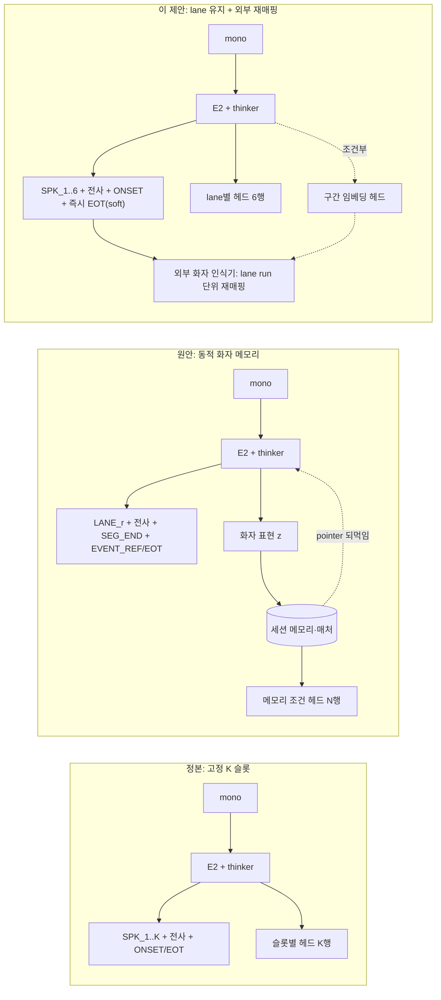
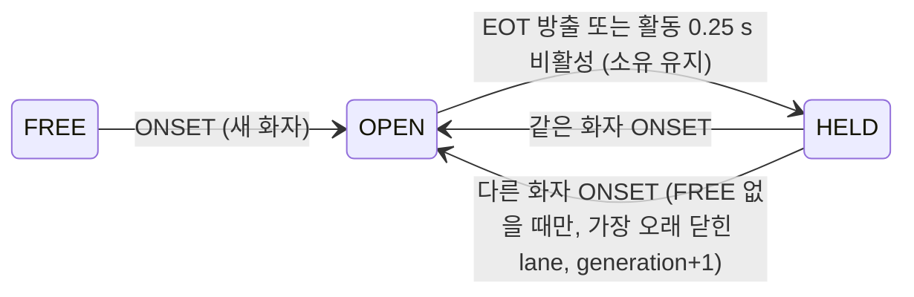
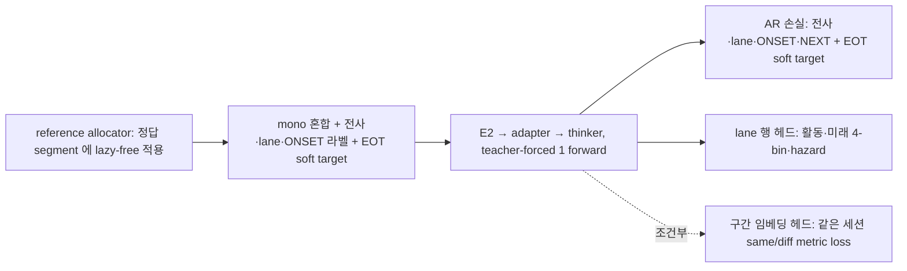

# Lane 유지형 화자 전사 제안 (설명 보고서)

그림이 포함된 판은 아티팩트 <https://claude.ai/code/artifact/5df5cfd8-9336-4417-b19f-e0bee4d5094b> 에 있다. 이 페이지는 같은 내용을 위키에 남기기 위한 텍스트·mermaid 판이다. 상세 규약과 실측은 [[output-phase2-dynamic-speaker-memory-plan-v2]] §3·§8·§10 을 따른다.

## 한 줄 요약

모델은 **"지금 말하는 사람들을 서로 다른 lane 에 나눠 적는 것"** 까지만 책임진다. "이 사람이 아까 그 사람인가"는 lane 을 오래 유지하는 규칙과 바깥의 화자 인식기가 맡는다. 정본 K 슬롯 모델에 옵션 두 개(lazy-free allocator, 구간 끝 즉시 EOT soft label)를 더하는 것이라 새 모델이 아니다. (2026-09-15 갱신: `<SEG_END>` 는 두지 않고 EOT 가 그 자리를 맡는다, [[decision-eot-immediate-soft-label]])

| 항목 | 값 |
|---|---|
| lane 수 R | 6 (AMI·ICSI·NOTSOFAR-1 실측) |
| 새 토큰 | 구조 토큰 없음. lane 1/2 는 `<SPK_A>/<SPK_B>` 재사용, lane 3–6 은 `<SPK_3..6>` |
| 학습 | 정본과 같은 단일 병렬 forward |
| 빠지는 것 | 모델 안 화자 메모리·매처·메모리 조건 헤드·pointer head·SEG_END·3 s C-mode 대기 |

## 1. 세 가지 숫자

- **N**: 세션 전체 인원. **S(t)**: 순간 동시 발화 수. **R**: 모델이 동시에 붙잡는 전사 채널 수.
- 정본 K 슬롯은 N 과 R 을 한 숫자로 묶는다. 원안(동적 메모리)은 모델 안에 메모리를 두어 푼다. 이 제안은 **R 은 고정, N 은 모델 밖**으로 보낸다.

## 2. 세 안의 구조



원안의 pointer 되먹임 때문에 학습이 순차가 되고 sidecar 가 필요했다. 이 제안은 되먹임이 없어 정본과 같은 병렬 학습이다.

## 3. 핵심 규칙: lazy-free

원안은 SEG_END 즉시 lane 을 비웠다. 이 제안은 **새 화자가 lane 을 필요로 할 때만**, 가장 오래 전에 닫힌 lane 부터 넘긴다.



- **따름정리**: N ≤ R 이면 빼앗기가 없으므로 lane 번호 = 도착 순서이고, 토큰열은 정본 K=6 시퀀스와 같다(EOT 후보 위치만 구간 끝).
- **EOT 오방출·미방출의 영향**: lane 소유는 바뀌지 않으니 후속 전사는 같은 lane 의 새 구간이 된다. 오귀속이 없고 구간 수만 는다.

## 4. 토큰열 예시 (설명용 R=3, 4번째 화자 등장)

```text
[AUDIO_k]    <SPK_A><ONSET> 안녕하세요 저는 <SPK_B><ONSET> 네 <NEXT_AUDIO>
[AUDIO_k+n]  <SPK_A> 김입니다 <SPK_A><EOT> <NEXT_AUDIO>              # 구간 끝 즉시 EOT 후보(target p_end), lane 1 유지
[AUDIO_j]    <SPK_A><ONSET> 그리고요 <NEXT_AUDIO>                     # 같은 화자 재개 = 같은 lane (앞 EOT 는 낮은 p 였을 것)
[AUDIO_m]    <SPK_A><EOT> <SPK_B> 그렇군요 <NEXT_AUDIO>               # 마지막 lexical 직후 EOT
[AUDIO_p]    <SPK_A><ONSET> 잠깐만요 <NEXT_AUDIO>                     # FREE 없음 → 가장 오래 닫힌 lane 1 을 영희가 받음
[AUDIO_q]    <SPK_A><EOT> <NEXT_AUDIO>                                # 영희 구간 끝, 영희의 EOT
```

**EOT 의미**: 구간 끝에서 즉시 나오는 후보이며 학습 target 은 그 뒤 3 s 의 결과(교대 1.0 · 침묵 0.8 · 혼재 0.5 · 긴 pause 0.3 · 짧은 pause 0.0)다. p(EOT) 가 곧 종료 신뢰도이고 임계값은 런타임 정책이다. 3 s 대기가 없어 재배정 뒤 귀속 모호 문제도 사라진다. 상세는 [[output-phase2-dynamic-speaker-memory-plan-v2]] §11.

## 5. 왜 R=6 인가 (실측)

| 코퍼스 | 세션 인원 | R=4 재배정 | R=4 모호 상한 | R=6 재배정 | R=6 모호 상한 | R=8 재배정 |
|---|---|---:|---:|---:|---:|---:|
| AMI (171) | 3–5 | 0.17 % | 0.01 % | 0 | 0 | 0 |
| ICSI (75) | 3–10 | 10.9 % | 3.2 % | 2.41 % | 0.44 % | 0.19 % |
| NOTSOFAR-1 (237) | 3–8 | 17.8 % | 7.9 % | 2.26 % | 0.38 % | — |

R=4 는 재배정이 11–18 % 로 lane run 이 짧아진다(§6). R=8 은 이득이 0.2 %p 뿐이다. (모호 상한 열은 C-mode 였을 때의 값이며 즉시 EOT 에서는 0 이다.) 원자료 `raw/sources/experiments/2026-09-15-phase2-lane-sim/`.

## 6. 정체성을 밖으로 보내도 lane 유지는 필요하다 (실측)

비겹침 음성 증거가 0.5 초 미만인 구간의 비율:

| 코퍼스 | 구간 하나만 보고 판별 | lane run 전체로 판별 |
|---|---:|---:|
| AMI | 53.3 % | 1.0 % |
| ICSI | 48.9 % | 6.1 % |
| NOTSOFAR-1 | 66.4 % | 10.8 % |

"같은 사람 = 같은 lane" 라벨을 버리고 lane 을 무작위 배정하면 외부 재매핑이 절반의 구간에서 근거를 잃는다. 모델에게 세션 정체성을 평가·주장하지 않을 뿐, 라벨은 lane 유지형으로 만든다. 잔여 1–11 % 를 줄이는 유일한 수단이 모델 내부 표현을 내보내는 구간 임베딩 헤드이며, D2 probe 결과로 넣거나 뺀다.

## 7. 학습



정본 K 모델과 다른 점은 allocator 정책(`never_free` → `lazy_free`)과 EOT 의 soft target 뿐이며, N ≤ 6 세션에서 두 정책의 출력이 같음을 테스트로 고정한다.

## 8. 데이터와 실행 순서

데이터 배치는 [[output-phase2-dynamic-speaker-memory-plan-v2]] §5 와 같다(71631·134-1·otoSpeech 2인, AMI 3–5인, NOTSOFAR-1 3–8인 close-talk A등급, ICSI 3–10인, DiPCo·CHiME-6 평가/보조, 2화자 결합 합성). KO 는 3인 이상 A등급 자료가 없어 합성 조건으로만 보고한다.

1. **D0 프로토콜**: allocator 두 정책·lane 상태기·EOT 후보 직렬화·soft label collator·fixture 20개. N ≤ 6 에서 두 정책 출력 동일, 소유자 오류 0.
2. **D2 표현 probe**: E2 체크포인트로 71631·AMI 혼합의 화자 임베딩 EER(비겹침/겹침). 겹침에서 외부 인코더가 충분하면 구간 임베딩 헤드를 뺀다.
3. **Q0 데이터**: 화자별 채널 forced alignment → mono 혼합 → lazy-free 라벨.
4. **D1 학습**: 정본 Q1 잡에 K=6·lazy_free·EOT soft 옵션. 정본 K=6 대비 WER/CER·cpWER 회귀 ≤ 5 %, 유지 구간 내 EOT 오방출률 보고.
5. **외부 재매핑 + 장문**: lane run 단위 온라인 클러스터링, ICSI·NOTSOFAR 7인 이상 재배정 검출, 10–60분 자유실행.

모델 안 화자 메모리(원안 D3/D4)는 빠진다. 외부 재매핑이 7인 이상에서 실측으로 부족할 때만 재검토한다.

## 9. 결정이 필요한 것

| 결정 | 제안 | 근거 |
|---|---|---|
| 정본 Q0 의 K | 6 | §5 |
| lazy-free 를 정본 옵션으로 흡수 | 흡수 | N ≤ 6 에서 정본과 동일 출력, 새 구조 토큰 없음 |
| EOT 즉시 방출 + soft label | 결정됨(2026-09-15) | [[decision-eot-immediate-soft-label]] |
| 구간 임베딩 헤드 | D2 결과로 조건부 | §6 잔여 1–11 % |
| 모델 내 화자 메모리 | 보류 | 외부 재매핑 전제에서 근거 소멸 |

## 근거

- [[output-phase2-dynamic-speaker-memory-plan-v2]] §3.3·§8·§10 — 실측·검증
- [[output-phase2-dynamic-speaker-memory-plan]] — 원안
- [[output-phase2-streaming-asr-diarization-plan]] §4.1·§4.4·§6.3 — registry·블록 형식·C-mode
