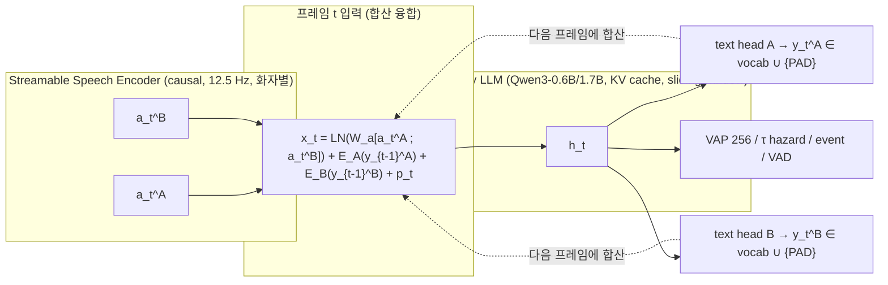

# 통합 스트리밍 SLM (USLM) — 구조 계획과 비판적 평가

사용자 방향(2026-09-04): RNN-T 로 전사를 독립 수행하는 [[output-model-architecture-proposal]] 대신, **하나의 LLM** 이
streamable encoder 출력을 실시간으로 받아 전사와 turn 예측을 함께 내는 구조. 이전 스텝에 LLM 이 예측한 text token 의
임베딩을 **다음 speech 프레임과 임베딩 단에서 합산(fuse)** 해 LLM 입력으로 넣는다.

## 계열 위치

| 계열 | 텍스트를 넣는 방식 | 시퀀스 길이 | 대표 |
|---|---|---|---|
| **A. 시간 동기 합산** | 매 프레임 x_t = W·a_t + E(y_{t−1}) (+PAD 토큰) | = 오디오 프레임 수 (고정) | Moshi Inner Monologue |
| B. Interleave / 결정 토큰 | 프레임 위치 ↔ 텍스트 위치를 번갈아, `<next_audio>` 로 "더 듣기" 결정 | 오디오 + 텍스트 (가변) | Muse Voice Transcribe, Speech ReaLLM |
| C. Transducer | 인코더 프레임 × 예측기 상태 → joint 로 blank/토큰 | 격자 | RNN-T (현재 Nemotron) |

사용자 제안은 **A** 다. A 는 "매 프레임 blank 또는 토큰" 이라는 점에서 **C 를 LLM 으로 옮긴 것** 과 같다 — LLM 상태가 predictor,
합산이 joint 의 역할. 이 관점이 평가에 유용하다 (RNN-T 의 알려진 성질이 대부분 그대로 따라온다).

## 제안 구조 (USLM v0)



```text
 t-1                         t                          t+1
 a_{t-1}^{A,B} ──┐        a_t^{A,B} ──┐             a_{t+1} ──┐
 E(y_{t-2})   ──┼─ x ─ LLM ─ h ─┬─ y_{t-1}^A,B ──┼─ x ─ LLM ─ h ─┬─ y_t ──────┼─ ...
                 │              └─ VAP/τ/event    │              └─ VAP/τ/event
                 └───────── (합산) ───────────────┘
   PAD 가 대부분(≈70–80 %): "듣는 중".  토큰은 발화 종료 + δ(160–320 ms) 뒤에 나온다.
```

구성 요소:

1. **Encoder**: 최종 backbone은 Nemotron FastConformer `[56,0]` (causal 실측 ≤80 ms, 12.5 Hz)이며, new adapter로 Qwen3-ASR thinker 입력 공간에 연결한다.
   Paper 2에서도 같은 encoder를 유지한다. Qwen AuT와 WavLM 류 비인과 encoder는 주 경로에서 배제한다 — [[decision-asr-backbone]].
2. **두 화자 = 두 텍스트 스트림.** 채널이 분리돼 있으므로 화자 귀속은 문제가 아니다. 겹침 발화는 두 헤드가 각각 PAD/토큰을 내면 자연히 처리된다
   (Muse 식 단일 직렬화 + speaker 토큰보다 단순하고 겹침에 강하다). 입력엔 두 스트림의 이전 토큰 임베딩을 모두 합산.
3. **프레임당 토큰 수**: 기본 1 (Moshi). 빠른 발화·한국어 BPE 폭주에 대비해 **프레임 내 inner loop ≤ K** (같은 a_t 를 재사용, RNN-T 처럼 blank 까지) 를 옵션으로.
4. **텍스트 지연 δ**: 정렬된 토큰을 종료 시각 + δ 프레임에 놓는다. δ 는 WER–latency 손잡이(2–4 프레임 = 160–320 ms 로 시작).
5. **감독**: Qwen3-ForcedAligner(80 ms, 한국어 지원)로 토큰 시각 → 시간 정렬 CE (PAD 포함, ±1 프레임 label smoothing).
   VAP/τ/event/VAD 헤드는 h_t 위에 그대로 ([[turn-taking-objectives]]).
6. **LLM**: Qwen3-0.6B 텍스트 LLM(다국어) 또는 Qwen3-ASR 의 thinker(이미 AuT 임베딩을 소비하도록 학습됨 — 초기화 이점). LoRA 로 시작.
7. **추론**: 12.5 스텝/s, KV 캐시 + sliding window(예: 최근 60 s) + attention sink. 알고리즘 지연 = encoder ≤80 ms + δ + inner loop 계산.

## 비판적 평가 — 까다롭게

| # | 쟁점 | 심각도 | 판단 / 대응 |
|---|---|---|---|
| 1 | **프레임율 12.5 Hz 는 turn-taking 에 불리하다.** Stage 1 중간: 50 Hz CPC > 12.5 Hz 표현들, INT latency 1.3 s ([[task-stage1-encoder-probing]]) | **높음** | 단일 스트림의 순수성과 정면충돌. 대응 (a) 프레임 내 sub-frame 회귀 헤드(onset 오프셋 20 ms 단위), (b) LLM 25 Hz(2× 비용), (c) **50 Hz 음향 사이드 브랜치가 헤드에만 공급되는 하이브리드**. 실측 없이는 (c) 를 기본으로 두는 게 안전하다 |
| 2 | **1 프레임 = 1 토큰 상한.** 12.5 tok/s. 영어 BPE ~4–6 tok/s 는 여유, **한국어 Qwen BPE 는 음절·자모 분해로 10 tok/s 를 넘을 수 있다**; 빠른 발화 구간에서 폭주 | **높음** | 즉시 측정 가능: AI Hub·otoSpeech 전사를 Qwen3 tokenizer 로 세어 프레임당 토큰 분포 → K(inner loop) 결정. K>1 은 프레임당 LLM 스텝 수를 가변으로 만들어 실시간성을 흔든다 |
| 3 | **정렬 감독의 노이즈.** ForcedAligner 오차·발화 단위 라벨의 경계 오차(AI Hub 온셋 중앙값 30 ms, 끝은 넉넉함)가 CE 목표에 그대로 들어간다. RNN-T 는 격자 주변화로 이 문제를 피한다 | 중 | LLM vocab(15만) × T 격자는 RNN-T 손실 불가. 대안: (a) ±1–2 프레임 label smoothing, (b) **CTC 식 주변화**(T×V, 20 s 창 250×151k ≈ 38 M 실수 — 가능), (c) 정렬 QC 로 불량 구간 마스킹 |
| 4 | **PAD 우세와 방출 편향.** 입력의 70–80 % 가 PAD → LLM 이 PAD 사전확률을 학습해 토큰을 늦게/적게 낸다 (Moshi 가 보고한 문제). RNN-T 의 blank 편향과 동형 | 중 | 토큰 프레임 가중, δ 를 작게 시작, 방출 지연 분포를 학습 중 모니터링. 후속으로 Muse 식 **WER–delay RL** |
| 5 | **합산 융합의 간섭.** 오디오 임베딩과 토큰 임베딩이 같은 벡터에 섞인다. 스케일 불일치 시 한쪽이 지배 | 중 | 모달리티별 LayerNorm + 학습 스칼라. **ablation: 합산 vs concat+proj vs 게이트.** Moshi 가 합산으로 성공한 선례가 있어 치명적이진 않다 |
| 6 | **노출 편향·오류 전파.** 이전 예측 토큰이 다음 입력에 들어가므로 오인식이 이후 프레임을 오염. 12.5 Hz 라 전파 창이 길다 | 중 | teacher forcing 학습 + scheduled sampling; 평가 시 gold 조건 vs 자체 조건 격차 보고 (H2 의 실용 가치와 동일한 논점, [[acoustic-linguistic-fusion]]) |
| 7 | **긴 대화의 KV 캐시.** 15 min = 11 k 스텝, 1 h = 45 k. 1.7B 에서 45 k 캐시는 수 GB | 중 | sliding window 60 s + sink. turn 예측엔 20 s 로 충분(VAP 관행); 전사 문맥은 잃는다 — WER 영향 측정 |
| 8 | **turn 헤드가 LLM 은닉에 얹히는 것의 실익.** Stage 1 이 "ASR 표현이 turn 에 특별히 유리하지 않다" 로 가면, 12.5 Hz LLM 은닉이 CPC 50 Hz 를 이겨야 할 이유가 없다 | **높음** | **이 구조의 존재 이유는 "언어적 상태가 turn 예측을 돕는가"(H2)** 로 좁혀진다. 실측 전엔 이중 프레임율 모델([[output-model-architecture-proposal]])이 대조군으로 반드시 필요하다 |
| 9 | **Muse 와의 차별점이 얇아질 위험.** 텍스트 스트림 + onset/endpoint 토큰까지 가면 Muse 재현이 된다 | 중 | 차별점은 **미래 투사 헤드(VAP/τ)** 와 **두 화자 스트림**. onset/endpoint 를 토큰이 아니라 헤드로 두어 "무엇을 듣고 언제 끝났나" 가 아닌 "앞으로 누가 언제" 에 집중 |
| 10 | **컴퓨트는 오히려 작다.** 360 h × 12.5 Hz = 1,600 만 스텝/epoch — 0.6B LLM 이면 A100 1장에서 epoch 당 수 시간 | 낮음(호재) | 프레임당 1 스텝이라 학습 토큰 수가 텍스트 LLM 기준으론 매우 적다. inner loop K 가 커지면 비례 증가 |
| 11 | **평가 프로토콜의 latency 정직성.** 전사 latency(토큰 종료 시각 − 실제 단어 종료) 와 turn latency 를 δ·lookahead 포함해 보고해야 한다 | 중 | TurnBench 규약 그대로; 전사는 TTFT/Time-to-Final/revision rate ([[turn-taking-evaluation-protocol]]) |
| 12 | **RL 없이 Muse 급 WER–delay 균형이 나오는가.** Muse 의 핵심 성분은 RL | 중 | v0 는 고정 δ 로 가고, δ 를 무작위 샘플링해 학습한 뒤 추론 시 조절하는 "지연 조건부" 학습을 RL 전 단계로 |

**종합 판단**: 구조는 타당하고 선례(Moshi)가 있다. 그러나 **1·2·8 번이 실측으로 먼저 답해져야** 이 구조에 투자할 수 있다.
특히 8 번 — Stage 1 최종 결과가 "12.5 Hz ASR 표현이 turn 에 이점 없음" 이면, USLM 의 turn 성능은 이중 프레임율 모델보다
나쁠 가능성이 크고, 그때 USLM 의 정당성은 **"전사와 turn 을 한 모델로"** 라는 시스템적 이점(배포 단순화, 공유 계산)과
H2(언어 상태 이득)에서 와야 한다. 그 이점은 정량화 가능하다: 같은 GPU 예산에서 두 모델 vs 한 모델의 총 RTF·메모리.

## 검증 계획 (USLM 트랙) — 단계 번호는 [[output-interleaved-streaming-slm-architecture]] 의 U0–U5 로 통일

| 단계 | 내용 | 답하는 쟁점 | 관문 |
|---|---|---|---|
| **U0** streamability + 타당성 | encoder truncation audit(완료), **토큰율 → chunk 당 M 예산**, ForcedAligner 정렬·QC, interleaved target 생성기 | 2, 3 | — |
| **U1** aligned interleaved ASR | Nemotron frozen + Qwen3-0.6B(LoRA) + adapter, 텍스트 스트림만, 지연 커리큘럼, aux CTC | 4, 5, 6, 7 | **WER/CER 상대 열화 ≤ 10 % vs RNN-T** |
| **U2** self-conditioned streaming | self-generated history 혼합, gold/self 격차, corruption 학습, 20–60 s 창 carry | 6 | gold/self 격차 보고 |
| **U3** conversational multi-task | audio-clock 헤드(VAP/τ/VAD) + onset/endpoint/speaker 토큰, **50 Hz 사이드 브랜치 하이브리드 ablation**, 모델 A 와 비교 | **1, 8**, 9 | A 대비 turn 성능·총 RTF |
| **U4** adaptive emission | 지연 조건부 학습 → WER–delay MRT/RL (Muse 식) | 12 | Pareto 개선 |
| **U5** long-context·배포 | audio KV 요약, p99·backlog hard limit, 모델 크기 확대 | 7 | 1 h RTF·메모리 |

## Paper 1·2 와의 관계 (2026-09-04 갱신)

- **IS-SLM 이 Paper 1·2 의 단일 주력.** 이중 프레임율 모델은 기각([[decision-target-architecture]]).
- Paper 1 = Stage 1 probing 결과 + U0–U3. Paper 2 = 같은 Nemotron–adapter–Qwen thinker backbone 위의 U4–U5. 계획된 encoder 교체는 없다.
